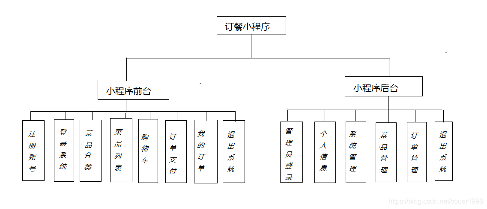
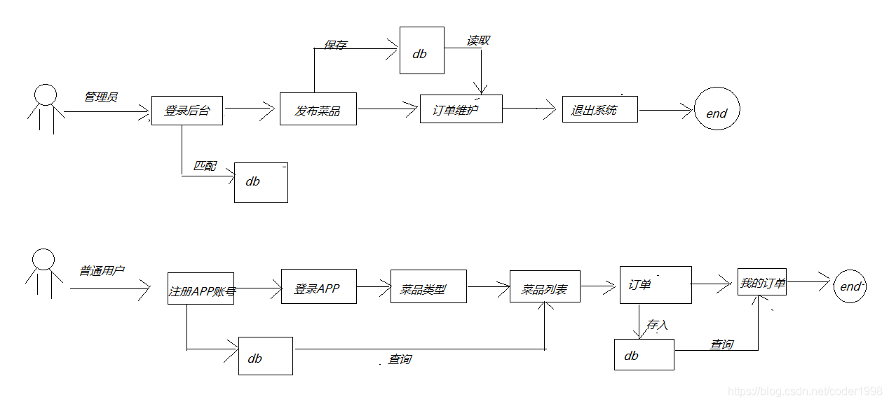
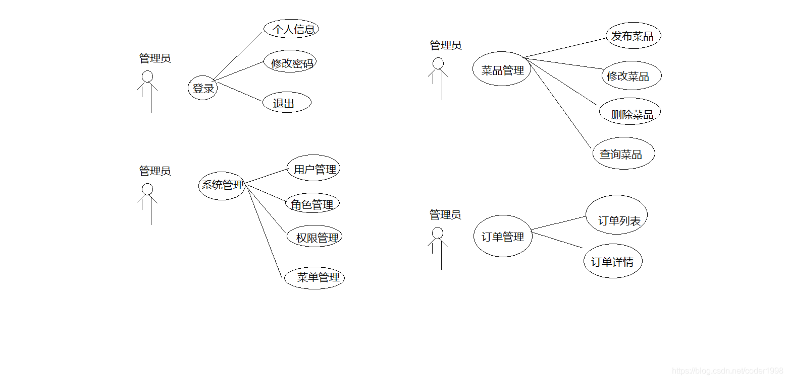
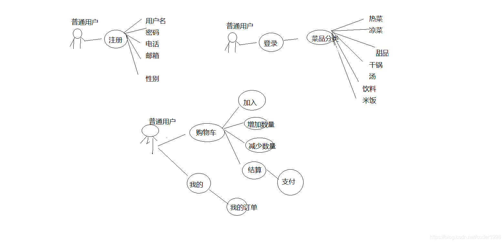

# 分工
### 菜单 ：吴鸿辉
### 订单 ：何忠生
### 评论 ：欧安怡
### 购物车 ：严纪远
### 用户信息 ：吕翔
### 后台权限 ：黄元宸

# 简介

后台界面在线演示地址：[http://www.macrozheng.com/admin/](http://www.macrozheng.com/admin/)

后台界面体验账号：admin  密码：macro123

项目功能结构图:

功能结构图，主要是描述这个项目的功能结构，项目分为前台和后台，如下图所示。

项目流程图:

项目的流程主要有管理员操作 还有普通用户操作，管理员在系统管理后台进行操作，普通用户在前端进行访问小程序，如下流程图

项目用例图:

用例图：也有管理员 和 普通用户的用例图

普通用户:

